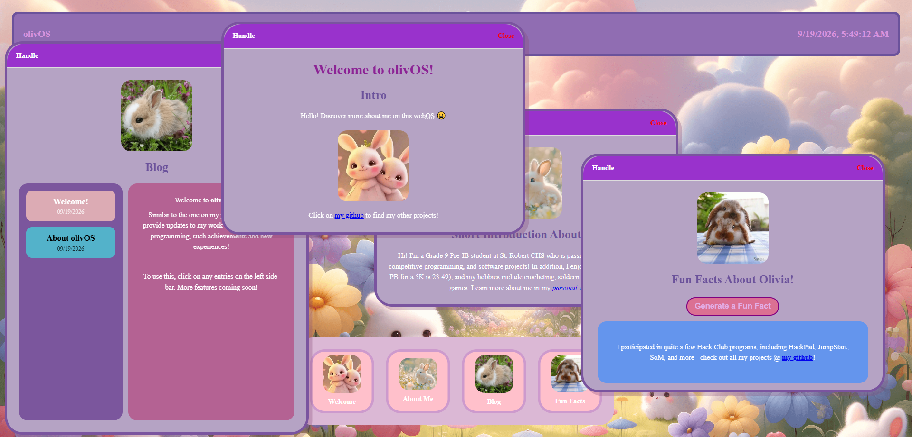

# olivOS

A bunny-themed web operating system which illustrates Olivia's passions and interests, while providing an outlook to her life!

## Try it out!

Link here: **[https://oliviasys.github.io/olivOS/](https://oliviasys.github.io/olivOS/)**

## Features

*olivOS mimics a real OS, with a:*
- Topbar with live clock
- Bottom bar with desktop icons to **select on first click, and open on the second**
- Draggable (click and hold on the `Handle` text), closable (click on `Close`), and overlapping windows (click a window to bring it forward!)
- *Easter Egg 🐣: text that changes colour when you hover over it! Try to find it 😄*

## Apps

|  App  |  Functionality  |
|-------|-----------------|
| **Welcome** | An intro to olivOS |
| **About Me** | A short introduction about me, *Olivia!* |
| **Blog** | Entries about my experiences, achievements, work in math and programming + A sidebar for selection |
| **Fun Facts** | A random generator of fun facts, all about me (the personal app I added!) |

## Programming Languages

- HTML
- CSS
- JavaScript

## Notes

- This project was built by **Olivia** for the *StarDance* Hack Club program, by following the *[JamHacks tutorial](https://jams.hackclub.com/batch/webOS)*.
- More features to come, perhaps a terminal app, game, and more easter eggs - for WebOS2!
